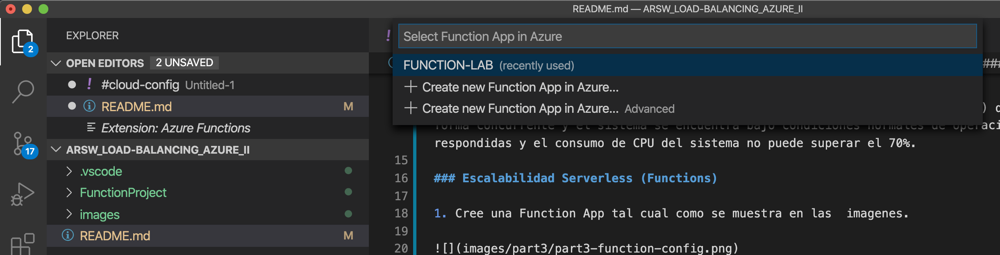

### Escuela Colombiana de Ingeniería
### Arquitecturas de Software - ARSW

## Escalamiento en Azure con Maquinas Virtuales, Sacale Sets y Service Plans

### Dependencias
* Cree una cuenta gratuita dentro de Azure. Para hacerlo puede guiarse de esta [documentación](https://azure.microsoft.com/en-us/free/search/?&ef_id=Cj0KCQiA2ITuBRDkARIsAMK9Q7MuvuTqIfK15LWfaM7bLL_QsBbC5XhJJezUbcfx-qAnfPjH568chTMaAkAsEALw_wcB:G:s&OCID=AID2000068_SEM_alOkB9ZE&MarinID=alOkB9ZE_368060503322_%2Bazure_b_c__79187603991_kwd-23159435208&lnkd=Google_Azure_Brand&dclid=CjgKEAiA2ITuBRDchty8lqPlzS4SJAC3x4k1mAxU7XNhWdOSESfffUnMNjLWcAIuikQnj3C4U8xRG_D_BwE). Al hacerlo usted contará con $200 USD para gastar durante 1 mes.

### Parte 0 - Entendiendo el escenario de calidad

Adjunto a este laboratorio usted podrá encontrar una aplicación totalmente desarrollada que tiene como objetivo calcular el enésimo valor de la secuencia de Fibonnaci.

**Escalabilidad**
Cuando un conjunto de usuarios consulta un enésimo número (superior a 1000000) de la secuencia de Fibonacci de forma concurrente y el sistema se encuentra bajo condiciones normales de operación, todas las peticiones deben ser respondidas y el consumo de CPU del sistema no puede superar el 70%.

### Escalabilidad Serverless (Functions)

1. Cree una Function App tal cual como se muestra en las  imagenes.

2. Instale la extensión de **Azure Functions** para Visual Studio Code.

3. Despliegue la Function de Fibonacci a Azure usando Visual Studio Code. La primera vez que lo haga se le va a pedir autenticarse, siga las instrucciones.

4. Dirijase al portal de Azure y pruebe la function.

5. Modifique la coleción de POSTMAN con NEWMAN de tal forma que pueda enviar 10 peticiones concurrentes. Verifique los resultados y presente un informe.

6. Cree una nueva Function que resuleva el problema de Fibonacci pero esta vez utilice un enfoque recursivo con memoization. Pruebe la función varias veces, después no haga nada por al menos 5 minutos. Pruebe la función de nuevo con los valores anteriores. ¿Cuál es el comportamiento?.

**Preguntas**

* ¿Qué es un Azure Function?
Es una solución la cual nos permite ejecutar de forma muy sencilla pequeños fragmentos de códigos lo cual facilita tener una aplicación en la nube sin preocuparnos de la infraestructura. Una de las mejores cualidades de esto es que podemos codificar en el portal de Azure esto nos ayuda a que si no tenemos un buen computador podamos realizar aplicaciones si esa limitación. Se basa en escala y baja demanda por lo cual solo se paga por lo consumido, esto quiere decir que se factura por el numero de peticiones ejecutadas. Para demostrar el poder de esta tecnología el primer millón de peticiones en un mes será gratis.
* ¿Qué es serverless?
Es un tipo de arquitectura en la que no se utilizan servidores físicos, sino que se asignan la responsabilidad de ejecutar un fragmento de código a un proveedor de nube, la cual se encarga de la asignación de recursos. Generalmente se ejecutan en contenedores Stateless que pueden ser actividades http u otras actividades.
* ¿Qué es el runtime y que implica seleccionarlo al momento de crear el Function App?
Es un intervalo de tiempo de ejecución en la cual el programa se ejecuta. En Azure esta relacionado con la versión del .NET, Nodejs, Python o java, en la que se basa el tiempo de ejecución. En este caso la versión de runtime es de 12 lo cual implica que el timeout sería de 5 minutos y además nuestra memoria se limpiara en este intervalo de tiempo. 
* ¿Por qué es necesario crear un Storage Account de la mano de un Function App?
Para que en algunas aplicaciones podamos tener cache y mejorar el rendimiento de nuestras aplicaciones. 
* ¿Cuáles son los tipos de planes para un Function App?, ¿En qué se diferencias?, mencione ventajas y desventajas de cada uno de ellos.
Consumption plan Ofrece escalabilidad dinámica y factura solo cuando la aplicación es ejecutada, tiene un timeout es de 5 minutos y brinda una memoria máxima de 1.5 GB por instancia, un almacenamiento de 1 GB y un máximo número de instancias de 200.

Premium Ofrece escalabilidad dinámica, se factura por el número en segundos de core y la memoria usada en las distintas instancias, puede tener timeouts ilimitados, memoria por instancia de 3.5 GB y un almacenamiento de hasta 250 GB, finalmente ofrece un máximo de 100 instancias.

Dedicated El cliente puede implementar manualmente la escalabilidad, puede tener timeouts ilimitados, memoría por instancia de 1.7 GB y una capacidad de almacenamiento hasta de 1000 GB y el numero de instancias es máximo 20. En este plan se paga lo mismo que por otros recursos de App Service, como las aplicaciones web.

* ¿Por qué la memoization falla o no funciona de forma correcta?
Debido a que el plan que utilizamos nos ofrece 1.5G las cuales en algunos casos esta memoria pude llegar a quedar corto con peticiones en las cuales tengamos que realizar muchos cálculos.
* ¿Cómo funciona el sistema de facturación de las Function App?
Se factura según el consumo de recursos y la ejecuciones por segundos. Los precios del plan de consumo incluyen 1 millones de solicitudes y 400.000 GB-segundos de consumo de recursos gratuitos al mes. Functions se factura según el consumo de recursos medido en GB-s. El consumo de recursos se calcula multiplicando el tamaño medio de memoria en GB por el tiempo en milisegundos que dura la ejecución de la función. La memoria que una función utiliza se mide redondeando a los 128 MB más cercanos hasta un tamaño de memoria máximo de 1.536 MB, y el tiempo de ejecución se redondea a los 1 ms más cercanos. Para la ejecución de una única función, el tiempo de ejecución mínimo es de 100 ms y la memoria mínima es de 128 MB, respectivamente.
* Informe
